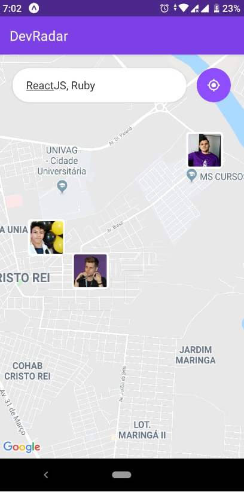
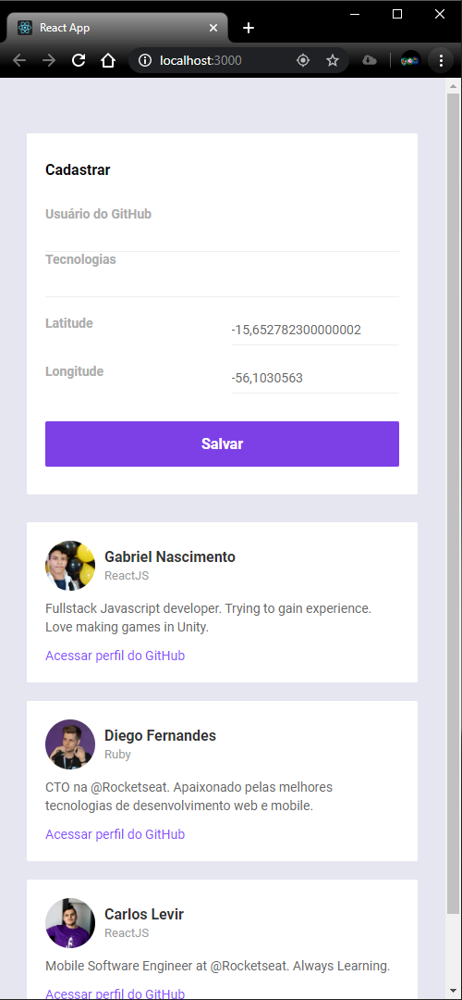
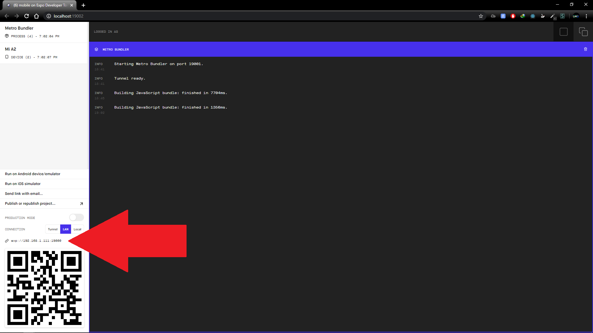
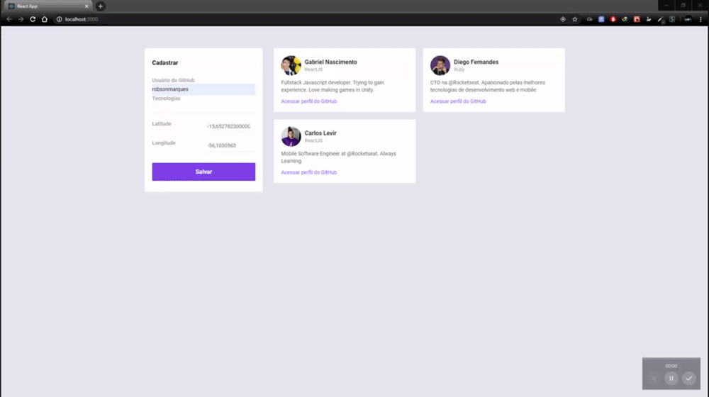
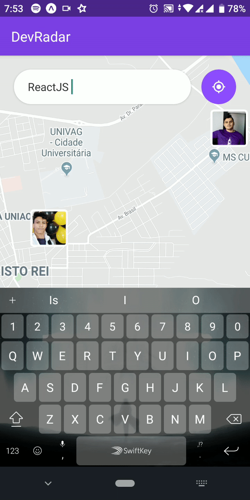
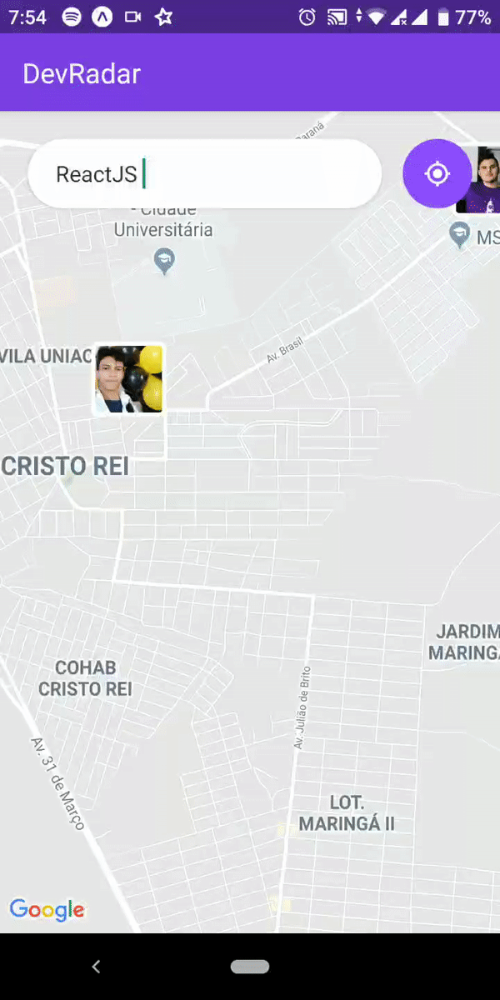

<h1 align="center">DevRadar</h1>

<h3 align="center">Encrontre Devs próximos a você podendo filtrar pelas tecnologias que usam.</h3>

 

## Como iniciar o projeto

#### Certifique-se de não estar usando as portas 3000 e 3333 

### Backend:
- Entre na pasta "backend".
- Rode ```yarn install``` ou ```npm install```.
- No arquivo "index.js" mude o mongoose.connect para uma instancia mongo sua (Cluster ou local mesmo). O padrão do projeto é local (Precisa do mongodb na máquina).
  -  
- Rode ```yarn dev``` ou ```npm run dev```. Por padrão a api será iniciada na porta 3333. Pode ser alterada na linha 20 do "index.js".

### Web
- Entre na pasta "web".
- Rode ```yarn install``` ou ```npm install```.
- Rode ```yarn start``` ou ```npm run start```. Pelo padrão do create-react-app a porta da aplicação web será a 3000. Se alterou a porta do servidor, lembre-se de ir em ```src/services/api.js``` e colocar a porta que usou em baseURL.

### Mobile
- Entre na pasta "mobile".
- Rode ```yarn install``` ou ```npm install```.
- Rode ```yarn start``` ou ```npm run start```.
- Em ```src/services/api.js``` altere o ip da baseURL para o que aparece em cima do QRCode do site no Expo. 

## Como usar

### Web
- Insira o usuário do github e as tecnologias do dev. As coordenadas são obtidas automaticamente, mas podem ser alteradas manualmente.


### Mobile
- Baixe o aplicativo ```Expo``` no seu smartphone ou em um emulador.
- Abra o aplicativo ```Expo``` e escaneie o QRCode do site ou coloque o ip do site da Expo que foi aberto quando iniciou a aplicação mobile.
- Insira as tecnologias desejadas no campo de texto e clique no botão ao lado para procurar os devs. Clique na foto deles para abrir a bio e clique na bio para abrir o perfil do github.

 

Projeto realizado na Semana Omnistack 10.  
